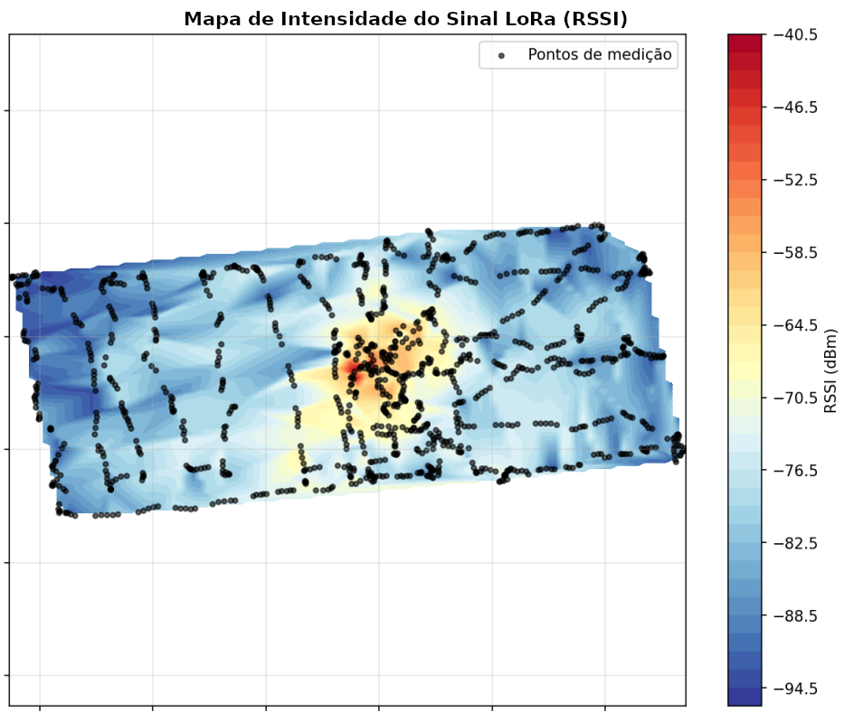
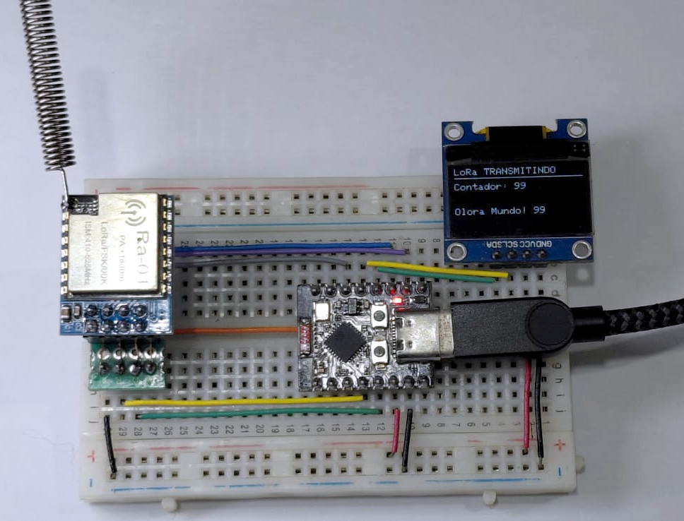
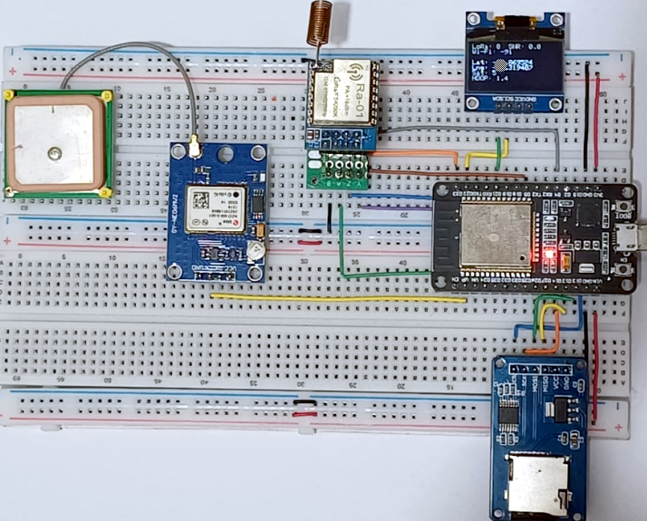
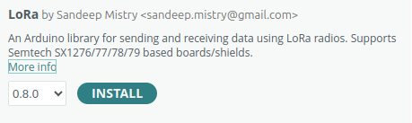
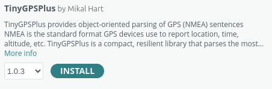
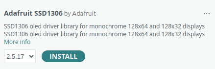
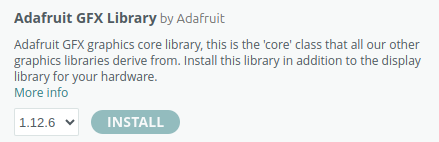

# RFMapper32

[](LICENSE) [](https://www.espressif.com) [](https://www.lora-alliance.org)

Sistema portátil de mapeamento de RF baseado em ESP32, com posicionamento GNSS e análise de cobertura LoRa e Wi-Fi.



## 🔍 Visão geral

O RFMapper32 combina hardware e software para coletar dados de sinal em campo e gerar mapas de cobertura.
O projeto inclui um transmissor LoRa fixo e um receptor móvel que registra GPS, RSSI LoRa e informações de Wi-Fi em um cartão SD.

## ✨ Destaques

- 📡 Receptor móvel com GPS e registro em cartão SD
- 📶 Coleta de RSSI LoRa e Wi-Fi passiva
- 🌡️ Geração de mapas de calor a partir dos dados coletados
- 🖥️ Display OLED para monitoramento local
- 🧩 Código baseado em ESP32 e Arduino

## 🛠️ Componentes

### Transmissor
- ESP32-C3 Super Mine
- Módulo LoRa RA-01
- Display OLED SSD1306
- Frequência: 433 MHz
- Configuração de LoRa: SF8



### Receptor móvel
- DOIT ESP32 DevKit v1
- Módulo LoRa RA-01
- GPS NEO M8N
- Módulo SD card
- Display OLED SSD1306
- Scanning Wi-Fi passivo



## 📁 Estrutura do repositório

- 🧩 `firmware/` — código Arduino para transmissor e receptor
- 🐍 `python/` — script de tratamento de dados e geração de mapas
- 🖼️ `images/` — imagens e exemplos de resultados
- 📄 `LICENSE` — licença do projeto

## 💾 Conteúdo de firmware

- `firmware/TrasmissoLoraBaseFixa/TrasmissoLoraBaseFixa.ino` — transmissor LoRa fixo
- `firmware/ReceptorLoraMovelGPS/ReceptorLoraMovelGPS.ino` — receptor móvel com GPS, LoRa, SD e OLED
- `firmware/Esp32_RA01_GPS_WiFi_SD/Esp32_RA01_GPS_WiFi_SD.ino` — receptor com coleta de Wi-Fi e gravação em SD

## 📚 Bibliotecas utilizadas

| Biblioteca | Link | No Arduino IDE |
| --- | --- | --- |
|  | [Arduino Board Support](https://www.arduino.cc/) |  |
|  | [arduino-LoRa](https://github.com/sandeepmistry/arduino-LoRa) |  |
|  | [TinyGPSPlus](https://github.com/mikalhart/TinyGPSPlus) |  |
|  | [Adafruit_SSD1306](https://github.com/adafruit/Adafruit_SSD1306) |  |
|  | [Adafruit-GFX-Library](https://github.com/adafruit/Adafruit-GFX-Library) |  |


## 🧠 Processamento de dados

O script `python/importaTrataFazMapa.py` lê dados CSV gerados pelo receptor, processa as medidas e cria mapas de calor estáticos.

### 🧪 Dependências Python

- Python 3
- pandas
- matplotlib
- scipy

Instalação:

```bash
python3 -m pip install pandas matplotlib scipy
```

### ▶️ Uso

1. Instale as bibliotecas necessárias no Arduino IDE:
   - LoRa
   - Adafruit GFX
   - Adafruit SSD1306
   - TinyGPSPlus
   - SD
   - WiFi
2. Abra o sketch desejado em `firmware/` no Arduino IDE.
3. Faça o upload para o ESP32 e conecte o hardware.
4. Colete dados com o receptor em movimento.
5. Copie o arquivo CSV do cartão SD para o computador.
6. Execute o script Python:

```bash
python3 python/importaTrataFazMapa.py
```

## 📄 Licença

Este projeto está licenciado sob a licença MIT. Veja `LICENSE` para mais detalhes.
